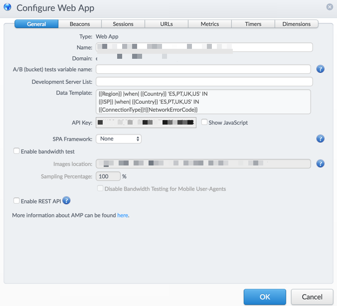

# Applications
In mPulse an "Application" is the main object to create and configure for monitoring any web or mobile application. On top of classic HTML5 web applications, there are several Single Page Application (SPA) frameworks supported:

1. Angular JS
2. Backbone JS
3. EmberJS
4. React
6. Other SPAs

For native mobile apps, it supports:

1. Apple iOS: Xcode and CocoaPod
2. Android: Gradle and Ant

The domain name of the application has to be added to monitor the application from mPulse. This is very important to as it would be the key to match for the metrics sent by the beacons to be accepted. The match patterns for the domain name are similar to those documented for [Chrome](https://developer.chrome.com/extensions/match_patterns) or [Firefox](https://developer.mozilla.org/en-US/Add-ons/WebExtensions/Match_patterns) extensions and add-ons.

Once the application is created, a random API Key is generated to uniquely identify the application.

### Javascript Snippet

#### HTML5 Web Applications
The boomerang javascript code snippet needs to be copied and instrument the page in the \<header> tag of the HTML documents of the web application to monitor.

The snippet basically creates a hidden iframe and calls a function that loads the boomerang library from mpulse site, adds the js to the iframe HTML and then fires the anonymous function "()" when the "onload" event triggers:

```
try {
   doc = iframe.contentWindow.document;
 } catch(e) {
   dom = document.domain;
   iframe.src="javascript:var d=document.open();d.domain='"+dom+"';void(0);";
   doc = iframe.contentWindow.document;
 }
 doc.open()._l = function() {
   var js = this.createElement("script");
   if (dom) { this.domain = dom; }
   js.id = "boomr-if-as";
   js.src = "https://s.go-mpulse.net/boomerang/" + "SKH8G-XA4XU-7CEVY-J48GX-VBMJ4";
   BOOMR_lstart=new Date().getTime();
   this.body.appendChild(js);
 };
 doc.write('<body onload="document._l();">');
 doc.close();
})();
```

#### Single Page Applications

Boomerang monitors Single Page App (SPA) navigations differently than how it monitors navigations on traditional websites.

On traditional websites, the browser completes a full navigation for every page. During this navigation, the browser requests the page’s HTML, JavaScript, CSS, etc., from the server, and builds the page from these components. Boomerang monitors this entire process.

On SPA websites, only the first page that the visitor loads is a full navigation. All subsequent navigations are handled by the SPA framework itself (i.e. AngularJS), where they dynamically pull in the content they need to render the new page. This is done without executing a full navigation from the browser’s point of view.

In this case, you will need to add an additional snippet within your SPA, so Boomerang can hook into your SPA framework events and send beacons to mPulse.

For more info about SPAs, check the following:
http://docs.soasta.com/boomerang/#single-page-apps

### mPulse Application Configuration
There are other optional parameters that can configured when creating the application:

**1. General Tab**
  - A/B Bucket:  Variable (free text) that can be used for A/B tagging.  A/B testing (also known as split testing or bucket testing) is a method of comparing two versions of a webpage or app against each other to determine which one performs better.
  - Development Server List: List of servers, domain or sites (comma separated) that I want to exclude beacons from. The information entered in this field is not counted into your mPulse data, and it does not appear on your Dashboards.
  - Data Template: Overrides country/region templates from the Tenant settings. Can be set only if the user has the "Tenant Adminstrator" permissions.
  - Bandwith Test: This is for measuring user bandwith distribution charts. It requires downloading the images from mPulse for and placing them in some web accesible location of the target server



**2. URLs (PageGroups)**
It's possible to configure PageGroups using variables sent from the beacon using:
  - Javascript variable
  - Query String
  - URL Substring (End of Text and Start of Text)
  - URL RegExp

**3.  Custom Metrics**
Metrics are non-performance data resulting from user actions during a customer visit.  These can include bounce rate, conversion rate, order totals, number of items in cart, number of shares traded, etc.  Bounce rate, session length, and session duration are metrics built into mPulse.  Most other metrics (including conversion and order total) will need to be defined as custom metrics in this tab.

**4. Customer Timers**
Timers are performance data, such as DNS lookup time, SSL connection time, front-end time, back-end time, and page load time.  On top of the default metrics sent by boomerang, it's possible to add custom timers configured using either client-side matching defined as part of your App, or by using a variable (written as Boomerang plugin). A Custom Timer can be based on any measurable user-defined value in the page.

**5. Custom Dimensions**
App Admins can define dimensions to track on each beacon. Beacon-level dimensions can be defined using one of six supported pattern-matching techniques, or value types found in the Configure Apps box, Advanced view, Dimensions tab. Akamai recommends defining dimensions on value types that have relatively few possible values. With that in mind, a good example is a dimension used to track free and paid users on a domain.
