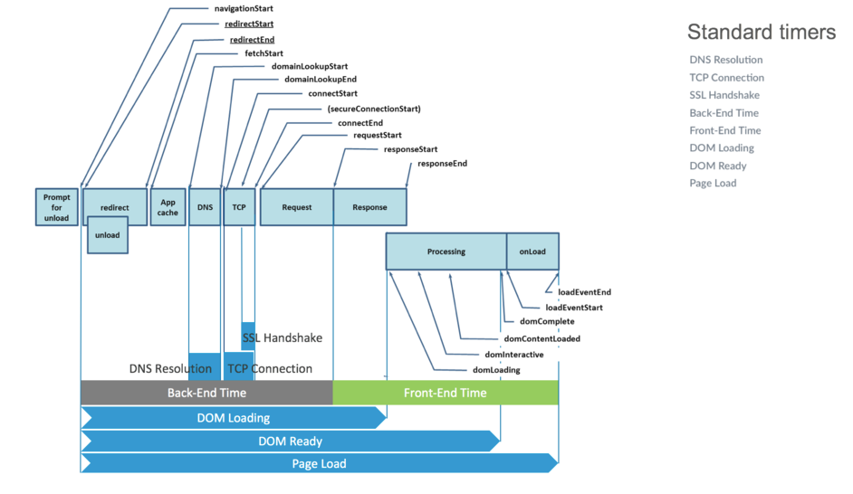
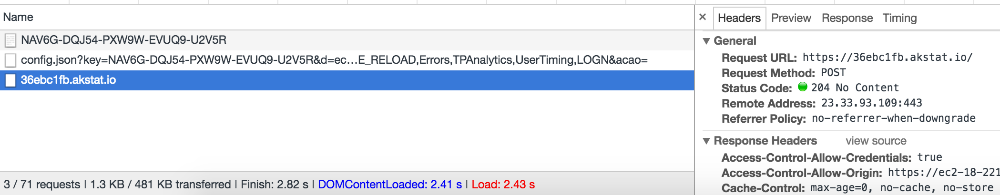

# Beacons
mPulse is built above the boomerang JavaScript library that collects web performance data from a user’s web browser and sends that back to the mPulse servers on a beacon. The simple definition of a beacon is that it is an HTTP(S) request with a ton of data included either as HTTP headers or as part of the Request’s Query String

mPulse will send beacon data for 100% of all page loads on a web site.  Because mPulse does not sample the data collection of metrics and timers, the margin of error can be kept as small as possible, resulting in a more complete and accurate portrayal of site health.

Beacons are fired immediately upon page load or when specifically called by AJAX or SPA navigation actions on a page. The size of the beacon can vary depending on the number of custom metrics, timers, and dimensions collected on the page, whether or not the beacon includes Resource Timing data, and how many resources the page uses.  Beacons without Resource Timing data will typically be 2K to 3K in size.  Beacons with Resource Timing data can be twice as large or larger.

The following is a reference of all the data fields that are sent in a web application beacon:
[http://docs.soasta.com/whatsinbeacon/#what's-in-an-mpulse-web-app-beacon](http://docs.soasta.com/whatsinbeacon/#what's-in-an-mpulse-web-app-beacon)

The following image depicts the standard HTTP standard timers collected by beacons:

It's possible to configure other custom timers to be sent from the beacon.

When an instrumented page is loaded, the network tab of the browser Development Tools should show three different calls related to mPulse:

1. The first one is a GET call that loads the "boomerang" library using the application key, example:
   `https://c.go-mpulse.net/boomerang/NAV6G-DQJ54-PXW9W-EVUQ9-U2V5R`

2. The second is a GET call (config.js) that also passes the application key on top of a number of parameters like the domain name, boomerange version, application key, session id, mpulse target server, plugins, etc. and it loads the configuration that is specific for this app like page groups, custom metrics, custom timers.

3. The third is a POST call that is actually sending all the beacon data to mPulse.

The following image shows the three calls filtered in Chrome Developer Tools:

