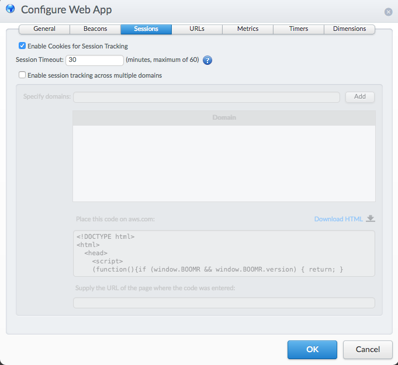

# Metrics
mPulse considers metrics to be non-performance data resulting from user actions during a customer visit.  These can include bounce rate, conversion rate, order totals, number of items in cart, number of shares traded, etc.  The following are built-in metrics:

* Bounce rate
* Session length
* Session duration

Most other metrics (including conversion, order total or revenue) will need to be defined as custom metrics.

### Sessions
The "Session Timeout" in the Sessions tab of the application defines how long mPulse will track metrics as part of the same session. If there's no activity after this value, the session will be considered as expired.

For a comprehensive explanation of the Session metric as computed from Google Analytics, please check the following document: https://goo.gl/d5fLsu

Session metrics are calculated using the Session Timeout setting, which is located on the Sessions tab in the Configuration screen of your app.

While configuring Session Timeout, consider the following:

* The default Session Timeout setting is 30 minutes, but any value between 1 and 60 minutes can be set.
* The timeout clock only starts when the user stops using the site and the session timeout is reset whenever there is user activity.
* Once the timeout is completed, the dashboard will show data for the time when the last user activity took place.
* Any session-based metrics such as a bounce rate or conversion rate will not be reported until the session timeout interval has passed for that session.

### Bounce rate
A bounce is a single-page session on your site. A bounce is calculated specifically as a session that triggers only a single request to the server, such as when a user opens a single page on your site and then exits without triggering any other requests to the server during that session.

The bounce rate can be defined as single-page sessions divided by all sessions, or the percentage of all sessions on your site in which users viewed only a single page and triggered only a single request to the  server. These single-page sessions have a session duration of 0 seconds since there are no subsequent hits after the first one that would let mPulse calculate the length of the session. 

### Custom Metrics
Custom Metrics are user-defined values that refer to a business goal, or to Key Performance Indicators (KPIs) such as revenue, conversion, orders per minute, widgets sold, etc. These values are defined using the Configure App, Metrics tab.

You can define custom metrics using Javascript variables, URL patterns, or using XPaths on the page.  mPulse can track percentages (such as for computing conversion rate) or numbers (such as for computing order totals or number of items purchased).

#### Conversion
It's usually considered as percentage metric that tracks a "successful" transaction on the web application. The term "successful" can be defined depending on the customers business needs.

For example, for an online retailer a customer completes a purchase could be considered as a successful conversion metric. In this case particular case, it could be implemented by tracking the percentage of sessions that reach a page view that confirms that a purchase has been completed (an “order confirmation” page or the logical equivalent for your business model).

#### Revenue
A Revenue metric should be created as a Currency type custom metric. Revenue is used to track the cumulative value of sales over a period of time.
