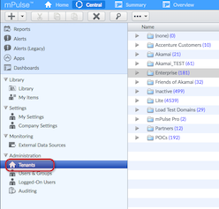
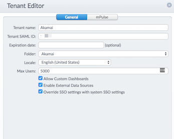
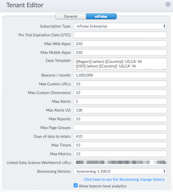

# Tenants
Logical container that can hold multiple applications and users. It usually holds all applications for a unique customer.

### Permissions
Permissions needed to create tenants is "Administrator". The "Tenant Viewer" is able to see other tenants apart from the assigned tenant but obviously does not allow any modification.

In this case, the "Tenant" folder will be visible under "Administration" in the right pane of mPulse:

### Folders Groups
The following main folders are used to group customers tenants depending on their nature:
  1. Enterprise: Enterprise Customers
  2. POCs: Proof of Concepts (presales or deals TBA). For "POCs" where the SSO integration with Luna is disabled, users need to add the /Login to the mpulse.soasta.com/concerto URL: https://mpulse.soasta.com/concerto/Login
  3. Lite: Freemium version of mPulse. Automatically created from the mPulse website by the users. Limitations: 1 user, 1 App and 100,000 beacons / month
  4. Inactive: When a POC trial time is finished and does not realize into a sale or stops paying the subscription it's moved to this folder. The "Account Status" attribute for the tenant is set to "Suspended" or Expiration date. No user can login to the tenant once it's suspended or expiration date is past due.

### Properties

The following are the "General" tab properties:

  * **Tenant Name:** Unique identifier for a customer account.
  * **SAML ID:** Unique identifier of the customer account that is tied to the "Account ID" field in Luna portal. This is used for SSO authentication (see the Single Sign-On topic below)
  * **Expiration date**
  * **Folder:** Folder the tenant belongs to
  * **Locale**
  * **Max Users:** Max number of users that can be assigned to this tenant.
  * **Allow Custom Dashboards:** Permits the users on the tenant creating dashboards other then system predefined.
  * **External Data Sources:** This can be set to pull synthetic users metrics from other analytics tools like AppDynamics, Amazon CloudWatch, Dynatrace, etc… so these can be shown in mPulse dashboards.
  * **Override SSO settings with system SSO settings:** This option needs to be checked in order to allow the SSO integration with Luna.

The "mPulse" tab properties contain additional tenant level settings. These are basically the subscription type (mPulse Enterprise, Trial or Lite), the "Data Template" (defines granularity of the regions you want to get the locations from) and all the limiting thresholds regarding beacons, applications, pagegroups, custom dimensions, etc. along with some other tenant level details. Most of these are self-explanatory and showed in the image below:

### Single Sign-On
The mPulse portal login has been integrated with Akamai's Luna portal through Single Sign-On (SSO). By default mPulse will always try to authenticate against "Luna". Check  [here](https://community.akamai.com/docs/DOC-8418-mpulse-akamai-single-sign-on-migration) for more info.

Just one Single Sign On (SSO) provider can be defined per Tenant. Each Tenant has a unique SAML ID. This value needs to be crosschecked to be the same in Luna for the customer account:

1. Go to Luna portal: https://control.akamai.com
2. Navigate to "Advanced Search" and type the customer name and select "in:Accounts".
3. Once the customer account is selected, choose "Review Contracts" from the bottom choices.
4. Verify the "Account ID" value. It should match the SAML ID in mPulse.

In the tenant, the SSO integration with Luna is enabled by selecting the tick "Override SSO settings with system SSO settings"
