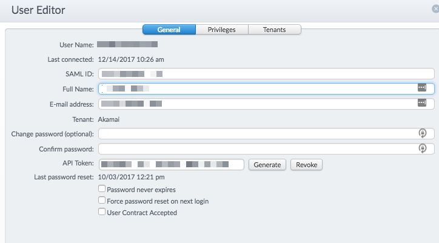
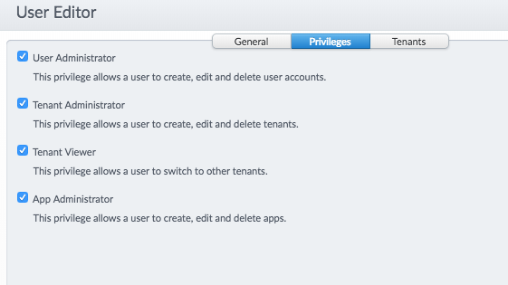
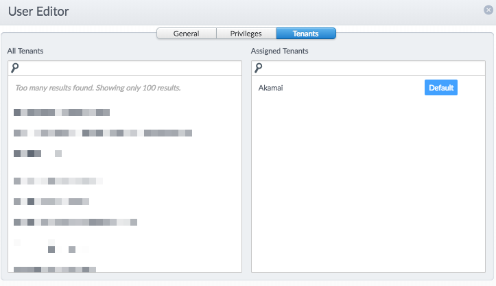

### Users and Groups

The users and groups can be configured at the "Administration" level in mPulse.

### General Properties
The properties of the "General" tab show the user identification fields like User Name, SAML ID, Full Name and E-mail address along with the default Tenant of the user. For programatical access, an API token can be generated for the user to authenticate with.

### User Privileges

The user privileges could be:
  1. User Administrator: Allows a user to create, edit and delete user accounts
  2. Tenant Administrator: Allows a user to create, edit and delete tenants.
  3. Tenant Viewer: Allows a user to switch to other tenants.
  4. App Administrator: Allows a user to create, edit and delete apps.

### User Tenants
The "Tenants" tab can be used to assign the tenants for the user (could be more than one).

Relevant documents:
[User Creation in mPulse](https://community.akamai.com/docs/DOC-9172-user-creation-in-mpulse)
[Users and Groups](https://community.akamai.com/docs/DOC-8448-users-groups)
