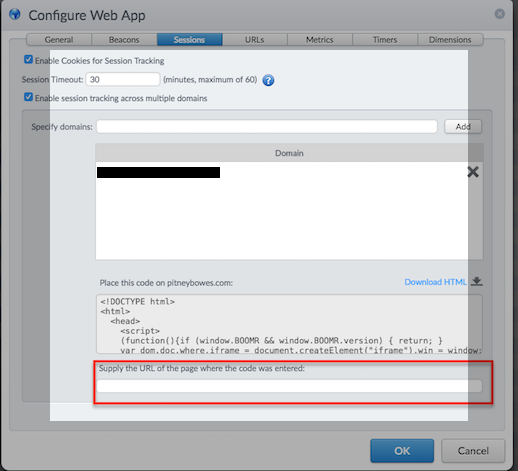

# Troubleshooting Scenarios

### User Cannot Login
As mPulse portal has been integrated with Luna SSO, previous customers can experieng login problems. In particular, for "POCs", the SSO integration is not enabled but mPulse portal will always redirect to Luna portal.

The customer should instead login directly to mPulse with the URL: https://mpulse.soasta.com/concerto/login

### No Beacons Are Received
1. Check the boomerang object is loaded in the customer webpage:
    		a. Go to Developer Tools
    		b. Open the Console
    		c. Type: BOOMR or BOOMR.version. Example:

          09:05:25.908  BOOMR
          09:05:25.908 {version: "1.500.0", window: Window, boomerang_frame: Window, plugins: {…}, t_start: 1508223921903, …}

          or

          09:05:25.908 BOOMR.version
          09:05:25.908 "1.500.0"

2. Check the application ID is correct in config.js call (Developer Tools -> Network Tab) and matches the one in configured in mPulse.

### mPulse snippet causing page to reload after some minutes on SPA

#### Problem

Some customers may claim that the mpulse tag is causing the page to reload after a few minutes, resulting in other 3rd party tags to re-trigger thus impacting performance.  This happens on an AngularJs page (mPulse is not configured for Angular).

#### Cause

When using a Tag Management System (TMS), it may appear to show a request to the same page you're already on, initiated by boomerang. This is caused by an "empty cross-domain file" problem. The `example.com` app might be configured for cross-domain with `example.us` and the API key being used is for `example.com`

If you use "about:blank" as the cross domain url, you will lose beacons because of the 5sec delay. For it to work as intended they need to setup a page with the proper cross domain snippet - or split the app into 2 apps. A work around is to update the app to 1.517 and set the URL to empty string after all their traffic picks up the new version (customers on the old version of boomr will be double hitting the web pages)

#### Resolution

Either specify a cross-domain URL on the app configurationlike shown in the image below or upgrade the boomerang version to 1.517+

Keep in mind that if you do it this way session tracking across domains is lost

TODO: Add more scenarios and troubleshooting tools/tips.
